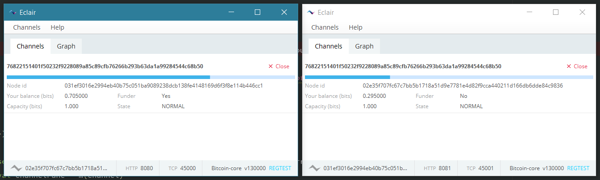

[](https://travis-ci.org/ACINQ/eclair)
[](LICENSE)
[](https://gitter.im/ACINQ/eclair)

**Eclair** (french for Lightning) is a scala implementation of the Lightning Network. It can run with or without a GUI, and a JSON-RPC API is also available.

This software follows the [Lightning Network Specifications (BOLTs)](https://github.com/lightningnetwork/lightning-rfc). Other implementations include [c-lightning] and [lnd].
 
 ---
 
 :construction: Both the BOLTs and Eclair itself are a work in progress. Expect things to break/change!
 
 :warning: Eclair currently only runs on regtest or testnet.
 
 :rotating_light: We had reports of Eclair being tested on various segwit-enabled blockchains. Keep in mind that Eclair is still alpha quality software, by using it with actual coins you are putting your funds at risk!

---

## Lightning Network Specification Compliance
Please see the latest [release note](https://github.com/ACINQ/eclair/releases) for detailed information on BOLT compliance.

## Overview



## Installation

:warning: **Those are valid for the most up-to-date, unreleased, version of eclair. Here are the [instructions for Eclair 0.2-alpha11](https://github.com/ACINQ/eclair/blob/v0.2-alpha11/README.md#installation)**.

### Configuring Bitcoin Core

Eclair needs a _synchronized_, _segwit-ready_, **_zeromq-enabled_**, _wallet-enabled_, _non-pruning_, _tx-indexing_ [Bitcoin Core](https://github.com/bitcoin/bitcoin) node. This means that on Windows you will need Bitcoin Core 0.14+. We highly recommend that you use Bitcoin Core 0.16 and will soon drop support for older versions. 

Run bitcoind with the following minimal `bitcoin.conf`:
```
testnet=1
server=1
rpcuser=foo
rpcpassword=bar
txindex=1
zmqpubrawblock=tcp://127.0.0.1:29000
zmqpubrawtx=tcp://127.0.0.1:29000

# lines below only needed with Bitcoin Core 0.16+
deprecatedrpc=addwitnessaddress
addresstype=p2sh-segwit
```

Eclair will use any BTC it finds in the Bitcoin Core wallet to fund any channels you choose to open. Eclair will return BTC from closed channels to this wallet.

On **__testnet__**, the addresstype of all your UTXOs needs to be `p2sh-of-p2wpkh`. This is the default addresstype starting with Bitcoin Core 0.16, which provides native segwit support. For earlier versions of Bitcoin Core, additional steps are necessary.

* for new wallets created with Bitcoin Core 0.16 or later, no additional steps are necessary. 
* for existing wallets migrated to Bitcoin Core 0.16 or later, you need to create a new address and send all your funds to that address.
* if you are running Bitcoin 0.15.1 or earlier, you need to create a segwit address manually. To do this, use the debug console, create a new address with `getnewaddress`, import it as a witness address with `addwitnessaddress`, and send all your balance to this witness address. If you need to create and send funds manually, don't forget to create and specify a witness address for the change output (this option is available on the GUI once you set the `Enable coin control features` wallet option).


### Installing Eclair

The released binaries can be downloaded [here](https://github.com/ACINQ/eclair/releases).

#### Windows

Just use the windows installer, it should create a shortcut on your desktop.

#### Linux, macOS or manual install on Windows

You need to first install java, more precisely a [JRE 1.8](http://www.oracle.com/technetwork/java/javase/downloads/jre8-downloads-2133155.html).

 :warning: If you are using the OpenJDK JRE, you will need to build OpenJFX yourself, or run the application in headless mode (see below).

Then download the latest fat jar and depending on whether or not you want a GUI run the following command:
* with GUI:
```shell
java -jar eclair-node-gui-<version>-<commit_id>.jar
```
* without GUI:
```shell
java -jar eclair-node-<version>-<commit_id>.jar
```

### Configuring Eclair

#### Configuration file

Eclair reads its configuration file, and write its logs, to `~/.eclair` by default.

To change your node's configuration, create a file named `eclair.conf` in `~/.eclair`. Here's an example configuration file:

```
eclair.server.port=9735
eclair.node-alias=eclair
eclair.node-color=49daaa
```

Here are some of the most common options:

name                         | description                                                                           | default value
-----------------------------|---------------------------------------------------------------------------------------|--------------
 eclair.server.port          | Lightning TCP port                                                                    | 9735
 eclair.api.enabled          | Enable/disable the API                                                                | false. By default the API is disabled. If you want to enable it, you must set a password.
 eclair.api.port             | API HTTP port                                                                         | 8080
 eclair.api.password         | API password (BASIC)                                                                  | "" (must be set if the API is enabled)
 eclair.bitcoind.rpcuser     | Bitcoin Core RPC user                                                                 | foo
 eclair.bitcoind.rpcpassword | Bitcoin Core RPC password                                                             | bar
 eclair.bitcoind.zmq         | Bitcoin Core ZMQ address                                                              | "tcp://127.0.0.1:29000"
 eclair.gui.unit             | Unit in which amounts are displayed (possible values: msat, sat, mbtc, btc)           | btc 

Quotes are not required unless the value contains special characters. Full syntax guide [here](https://github.com/lightbend/config/blob/master/HOCON.md).

&rarr; see [`reference.conf`](eclair-core/src/main/resources/reference.conf) for full reference. There are many more options!

#### Java Environment Variables

Some advanced parameters can be changed with java environment variables. Most users won't need this and can skip this section.

:warning: Using separate `datadir` is mandatory if you want to run **several instances of eclair** on the same machine. You will also have to change ports in `eclair.conf` (see above).

name                  | description                                | default value
----------------------|--------------------------------------------|--------------
eclair.datadir        | Path to the data directory                 | ~/.eclair
eclair.headless       | Run eclair without a GUI                   | 
eclair.printToConsole | Log to stdout (in addition to eclair.log)  |

For example, to specify a different data directory you would run the following command:
```shell
java -Declair.datadir=/tmp/node1 -jar eclair-node-gui-<version>-<commit_id>.jar
```

## JSON-RPC API

 method        |  params                                                                                | description
 ------------- |----------------------------------------------------------------------------------------|-----------------------------------------------------------
  getinfo      |                                                                                        | return basic node information (id, chain hash, current block height) 
  connect      | nodeId, host, port                                                                     | open a secure connection to a lightning node
  connect      | uri                                                                                    | open a secure connection to a lightning node
  open         | nodeId, fundingSatoshis, pushMsat = 0, feerateSatPerByte = ?, channelFlags = 0x01      | open a channel with another lightning node, by default push = 0, feerate for the funding tx targets 6 blocks, and channel is announced
  peers        |                                                                                        | list existing local peers
  channels     |                                                                                        | list existing local channels
  channels     | nodeId                                                                                 | list existing local channels opened with a particular nodeId
  channel      | channelId                                                                              | retrieve detailed information about a given channel
  allnodes     |                                                                                        | list all known nodes
  allchannels  |                                                                                        | list all known channels
  allupdates   |                                                                                        | list all channels updates
  allupdates   | nodeId                                                                                 | list all channels updates for this nodeId
  receive      | description                                                                            | generate a payment request without a required amount (can be useful for donations)
  receive      | amountMsat, description                                                                | generate a payment request for a given amount
  send         | amountMsat, paymentHash, nodeId                                                        | send a payment to a lightning node
  send         | paymentRequest                                                                         | send a payment to a lightning node using a BOLT11 payment request
  send         | paymentRequest, amountMsat                                                             | send a payment to a lightning node using a BOLT11 payment request and a custom amount
  checkpayment | paymentHash                                                                            | returns true if the payment has been received, false otherwise
  checkpayment | paymentRequest                                                                         | returns true if the payment has been received, false otherwise
  close        | channelId                                                                              | close a channel
  close        | channelId, scriptPubKey                                                                | close a channel and send the funds to the given scriptPubKey
  forceclose   | channelId                                                                              | force-close a channel by publishing the local commitment tx (careful: this is more expensive than a regular close and will incur a delay before funds are spendable)"
  help         |                                                                                        | display available methods

## Docker

A [Dockerfile](Dockerfile) image is built on each commit on [docker hub](https://hub.docker.com/r/ACINQ/eclair) for running a dockerized eclair-node.

You can use the `JAVA_OPTS` environment variable to set arguments to `eclair-node`.

```
docker run -ti --rm -e "JAVA_OPTS=-Xmx512m -Declair.api.binding-ip=0.0.0.0 -Declair.node-alias=node-pm -Declair.printToConsole" acinq\eclair
```

If you want to persist the data directory, you can make the volume to your host with the `-v` argument, as the following example:

```
docker run -ti --rm -v "/path_on_host:/data" -e "JAVA_OPTS=-Declair.printToConsole" acinq\eclair
```


## Resources
- [1] [The Bitcoin Lightning Network: Scalable Off-Chain Instant Payments](https://lightning.network/lightning-network-paper.pdf) by Joseph Poon and Thaddeus Dryja
- [2] [Reaching The Ground With Lightning](https://github.com/ElementsProject/lightning/raw/master/doc/deployable-lightning.pdf) by Rusty Russell
- [3] [Lightning Network Explorer](https://explorer.acinq.co) - Explore testnet LN nodes you can connect to

[c-lightning]: https://github.com/ElementsProject/lightning
[lnd]: https://github.com/LightningNetwork/lnd

